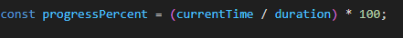
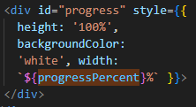
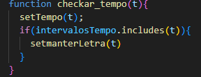

## 1 Instalação

Clone esse repositóio no seu computadro e em seguida execute ```npm install --only=dev```. Fazendo isso
serão instaladas apenas os pactoes necessários para executar esse projeto

## 2 Sobre As Músicas

As informções necessárias para a exibição das músicas fica armazenada em uma Array dentro do arquivo ```musicas.js```
Esse Array possui um Json para cada música. Dentro deles é necessárioque haja as seguintes chaves:

```nome``` Que irá conter um Array com duas Strings, que juntas forma o nome da música

```foto:``` Um String com o caminho para a foto. A foto obrigatoriamente vai estar a pasta `public` 

```cor``` A primeira cor do degradê da página

```cor2``` A segunda cor para o degradê da página

```musica``` Um string com o  caminho para música, que também estará na página `public`

```artista``` Uma string com o nome do artista/banda

```album``` Um string com o Nome do album

```letras``` Um array com várias arrays´s dentro. Contendo o tempo da musica no formato "M.SS" 
e a frase da música, respectivamente.

Seguindo o exemplo:


## 2.1 Sobre o player

Bom, no HTML temos a tag ```<audio>``` que por sua vez exibe e reproduz um audio com player, e temporizador. 
Todavia essa tag peca muito no quesito UX Design pois ela não nos permite alterar nativamente 
qualquer característica da aparência desse player, como cores e afins. Por isso decidi criar minha própria progress bar
e sincroniza-la com a tag <audio> por meiodo evento ```audionewupdate```. Esse evento é disparado 4 vezes por segundo.  


Esse ```progressPercent``` é usado para checar em quantos porcento está o aúdio, fazendo isso atraves 
de uma simples regra de três. Esse percentual por sua vez é jogado diretamente na ``div`` do progress bar



Fazendo assim com que ela se mova em sincronia com a execução do áudio.

## 2.2 Sobre a Exibição das Frases

Agora a parte mais importante do desafio, exibir as frases a medida que a música vai passando.
Bem, a princípio tive alguns problemas, e fui tentando soluções ineficazes. Como por exemplo usar um laço ``for``
para procurar qual dos tempo listados no json corresponde ao tempo exato da música. Mas vi que isso tornaria 
a execução do código mais ineficaz e pesada. Então acabei tendo uma ideia. Condicionar a classe de cada elemento ``<p>``
a aparecer só quando seu tempo for deteminado no hook ``useState``, vamos por partes.

Primeiramente eu importo o array do arquivo ```musicas.js```, e armazeno ele na constante ``dados``.
Dentro de uma <div> eu pego o `dados.letras`, que armazena os arreys com o tempo 
e as frases. Eu uso função ``map`` que é um como um forEach. Para cada array ela vai criar um elemento
``<p>`` contendo a frase correspondente. Ja no ``className`` de cada elemento <p> eu determino uma condição 
para nomeá-lo. A condição é ```manterLetra == index[0]```.

```index[0]```é o primeiro elemento do array, que correspondo ao tempo da frase
```manterLetra``` ´e mais um `useState`, porém esse é usado para segurar o tempo da frase.

Então a lógica é bem simples, enquanto a música é repoduzida a variável ``manterLetra`` esta sendo atualizada,
no momento que o valor dela for igual ao valor determinado para cada frase, a classe dela mudará para
outra que fará ela aparecer seguida de uma animação. 

# Mas, porque não usar a variável Tempo🤔?

Bom, pode não ser tão simples.....
Vamos mostrar com um exemplo.

```[2.03, "Dentro da hilux]```

```[2.04, "Ela movimenta no rítimo do Tuts Tuts"]```

```[2.07, "Vidro embassando ela rossando na fivela"]```


No momento que a variável ``Tempo`` obtiver o valor de 2.04 ela irá exibir a segunda frase, 
porém como eu falei anteriormente essa variável é atualizada a cada segundo, o que significa dizer 
que o segundo seguinte essa variável tera o valor de 2.05, a outra frase irá desaparecer, e nenhuma vai aparecer
pois a próxima só aparecerá em 2.07. Isso significa dizer que TODAS as frases teriam apenas 1 segundo
de aparição para o usuário, independente do tamanho dela. 
A principio pensei em calcular o tempo de exibição dela por meio da quantidade de caracteres vezes o tempo, mas é inviável pois dependendo da música o cantor pode cantar mais lento ou mais rápido, eis que me veio ideia de criar 
a variável global ```manterLetra``` 

Ela funcionada seguinte forma

# 1.
Assim que o programa é iniciado ativa a função``useEffec`` nela eu puxo o array contendo as frases e os 
tempos, passo em um lupe for e crio um outro array APENAS com os tempos, por exemplo: [2.09, 1.034] 
Então armazeno eles em uma variável global chamada ``intervalosTempo``
# 2.
Enquanto o áudio for executado haverá a seguinte dinâmica:


``setTempo`` determina o tempo a cada segundo já em seguida chequamos se dentro de ``intervalosTempo`` há 
esse tempo e só então determinamos a variável ```manterLetra```.
Essa variável só haverá mudança quando de fato houver um tempo listado. Então não vai haver um momento 
que não tenha uma letra sendo exibida.  

## 3 Sobre a troca de Músicas

Ela funciona de maneira simples. HÁ um **useState** chamado `Indice`, nele fica o indice referente ao número de cada json dentro do array do arquivo `musicas.js`.
Quando o usuário cliqua em próxima ativa uma função, essa função por sua vez zera todas a variáveis globais como `Tempo`, `manterLetra`, e etc. E em seguida chequa o limite 
do array. Pois caso o usuário já esteja no final da lista ela joga coloca o `Indice` em 0, e caso esteja no começo e o usuário clique em voltar o valor do `Indice` será igual
ao último elemento. 

Bom espero que eu tenha sido sucinto e claro na explicação, Abraços 🖖
